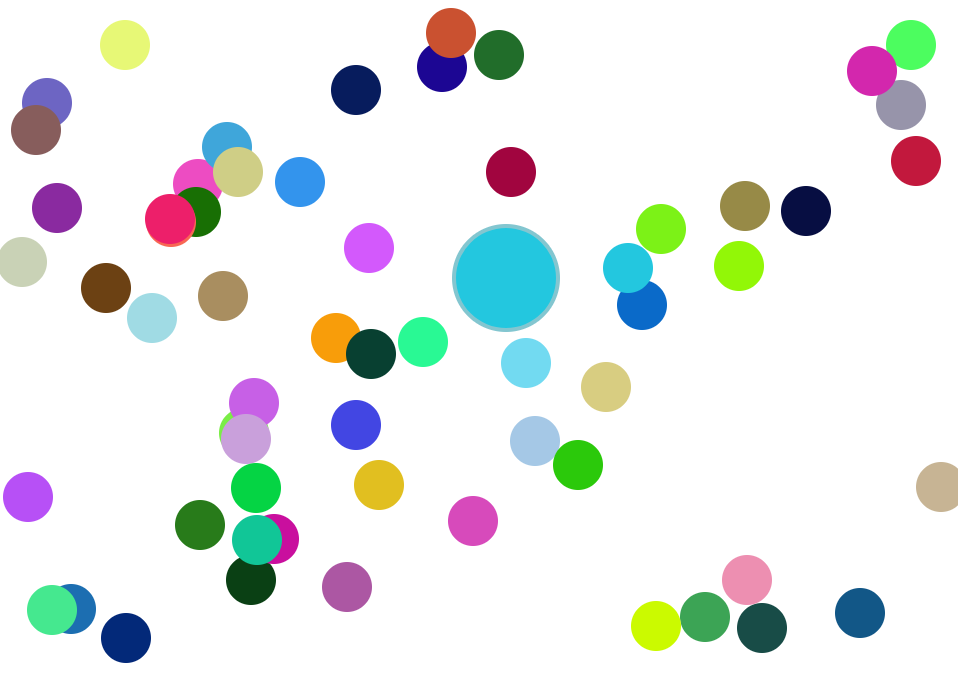

# Javascript-Animations-Balloons

This project demonstrates the creation of animated bouncing balls using HTML, CSS, and JavaScript. The balls react to cursor interaction and move accordingly.



## Demo

You can see a live demo of the currency converter app [here](https://rh-playground.github.io/Javascript-Animations-Balloons/).

## Features

- Interactive bouncing balls
- Mouse movement detection
- Bouncing effect on collision with the cursor
- Responsive design

## Technologies Used

- HTML
- CSS
- JavaScript


## Getting Started

To run the project locally, follow these steps:

Clone the repository:

   ```bash
   git clone https://github.com/RH-Playground/Javascript-Animations-Balloons.git

